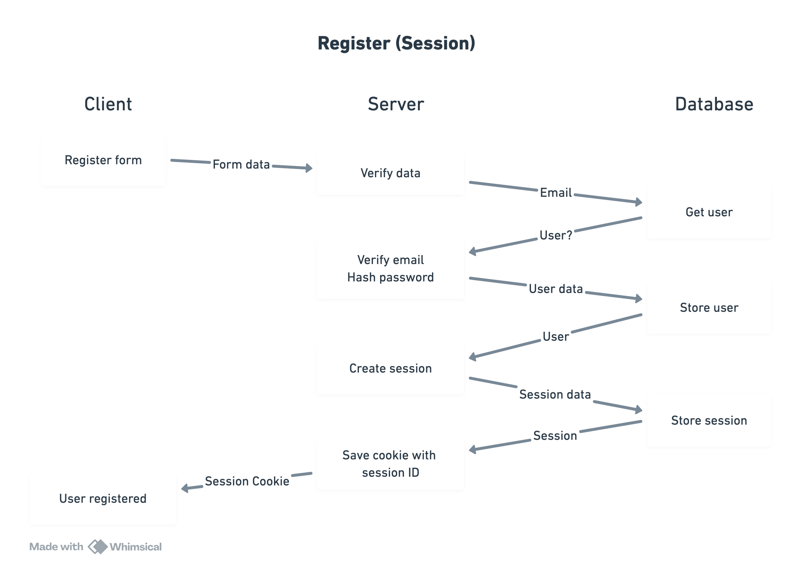
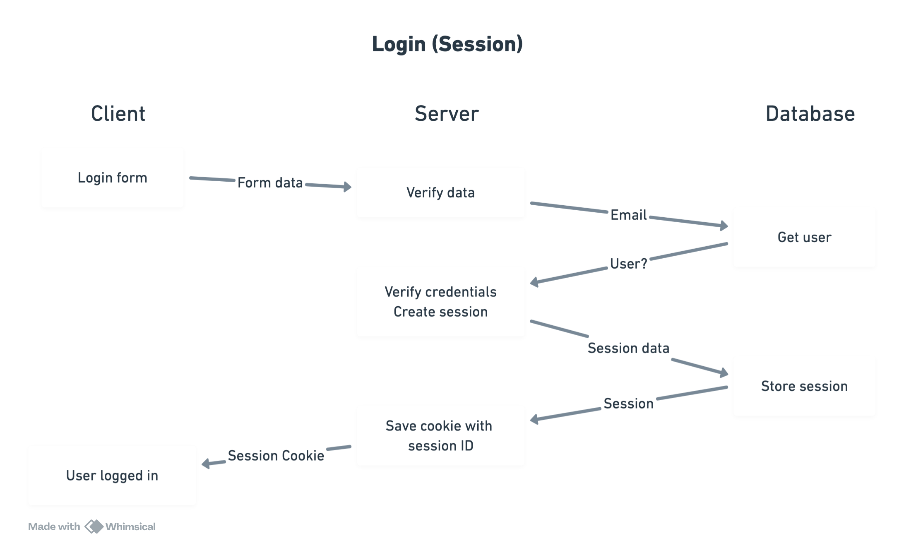
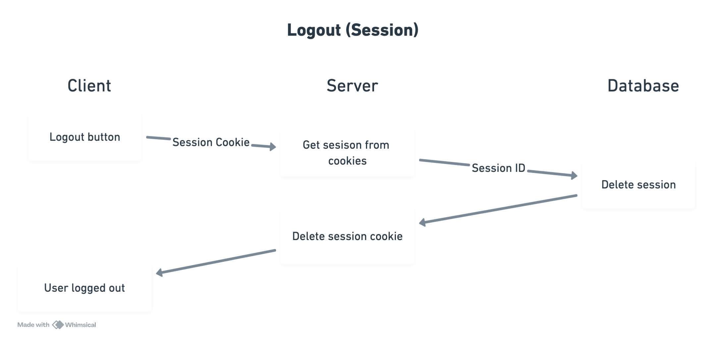
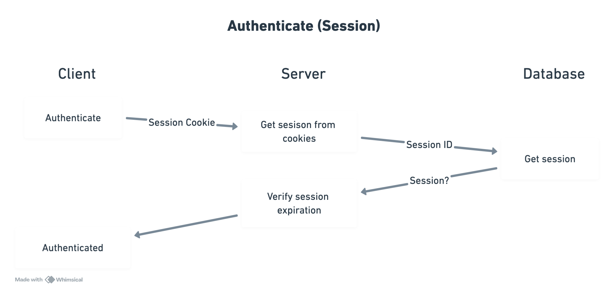

# Next Session 🍪

This is an example implementation of cookie-based authentication with session stored in database.
The structure of this project follows the React Bulletproof architecture.

## Register



## Login



## Logout



## Authenticate



### Other considerations

- Cookies are marked as HttpOnly to prevent access via JavaScript.
- Cookies are marked as Secure to ensure transmission over HTTPS only.
- Cookies use SameSite=Strict parameter to prevent CSRF attacks.
- Session expires after 7 days.
- Passwords are hashed with a unique salt before storage.

## Tech Stack

- **Database:** Postgres + Kysely
- **Design System:** Shadcn

## Run Locally

Clone the project

```bash
  git clone https://github.com/tomguillermou/next-session.git
```

Go to the project directory

```bash
  cd next-session
```

Install dependencies

```bash
  npm install
```

Start the development server

```bash
  npm run dev
```

## Environment Variables

To run this project, you will need to add the following environment variables to your .env file :

`DATABASE_URL`
